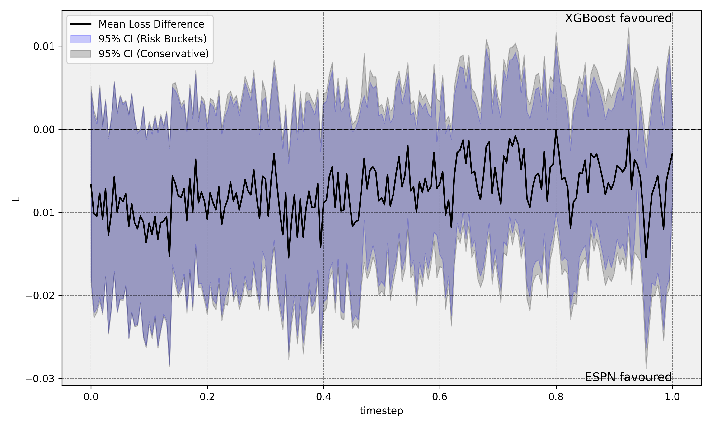
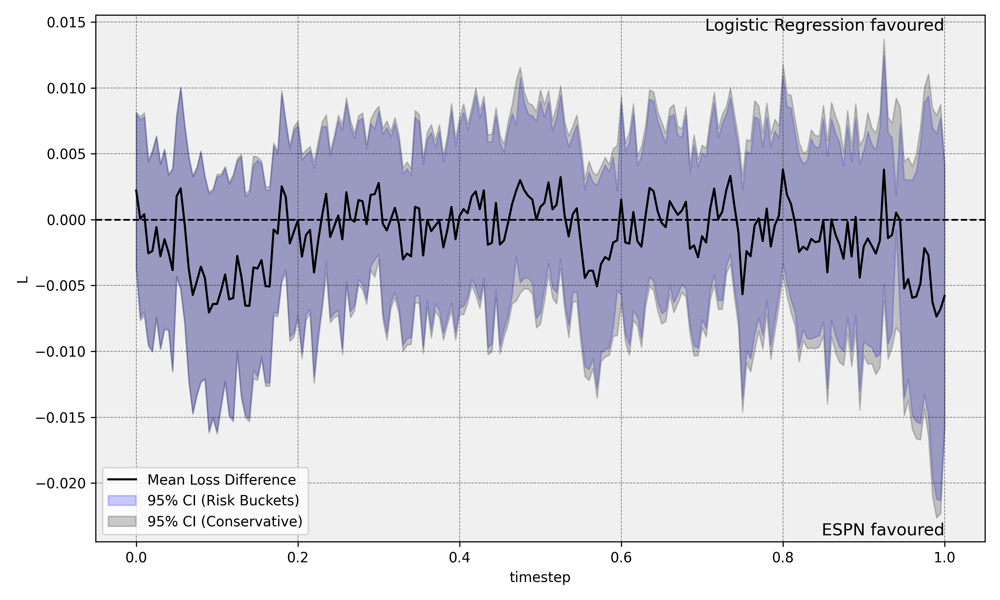
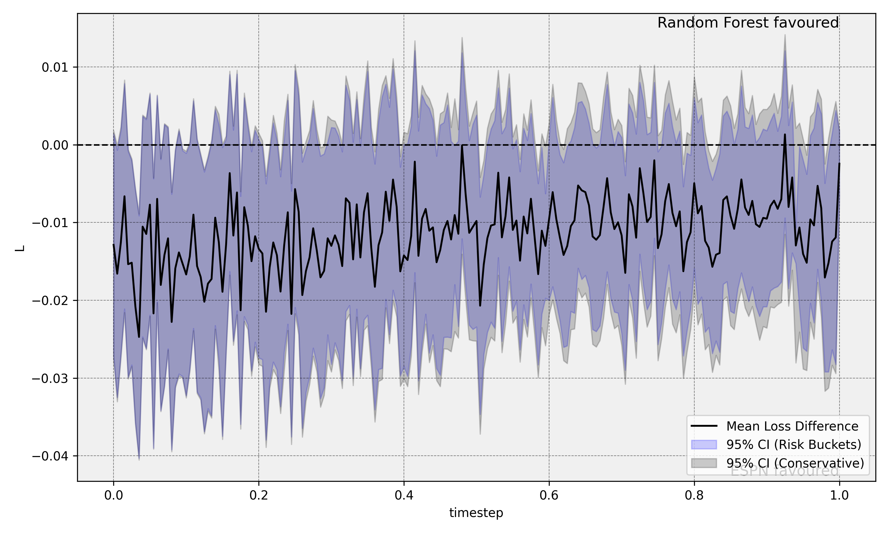
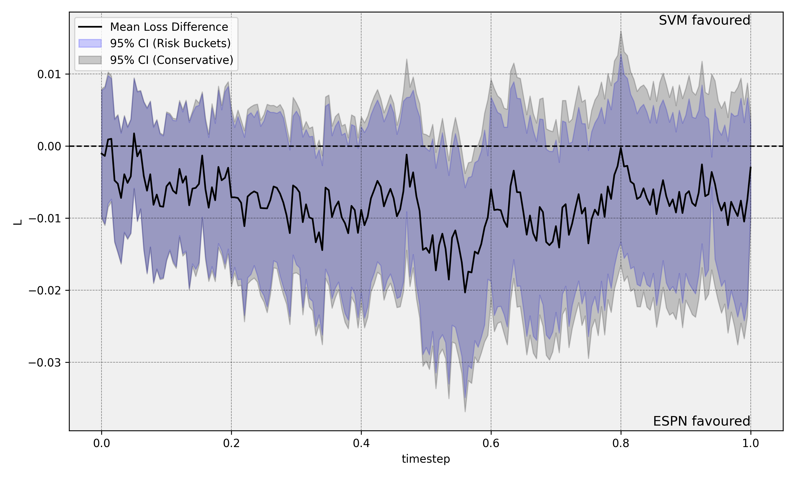
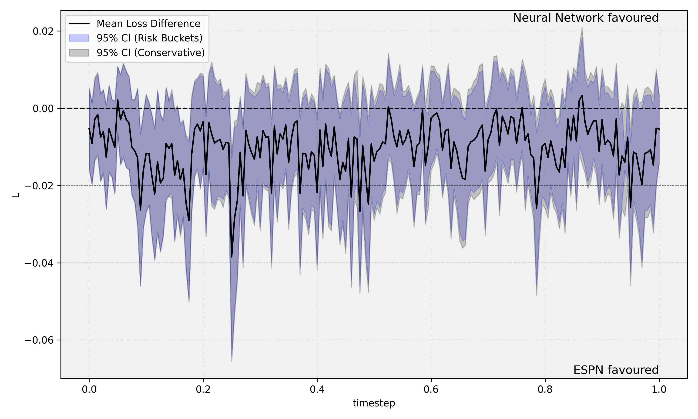
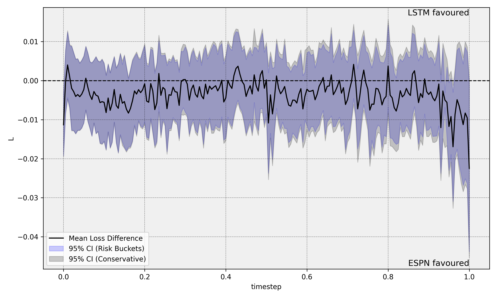
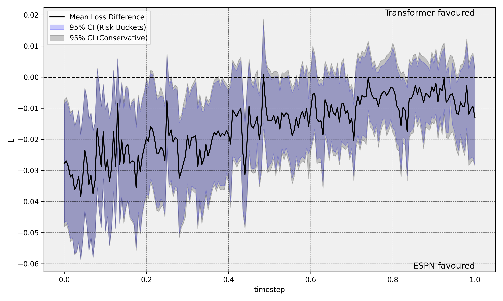
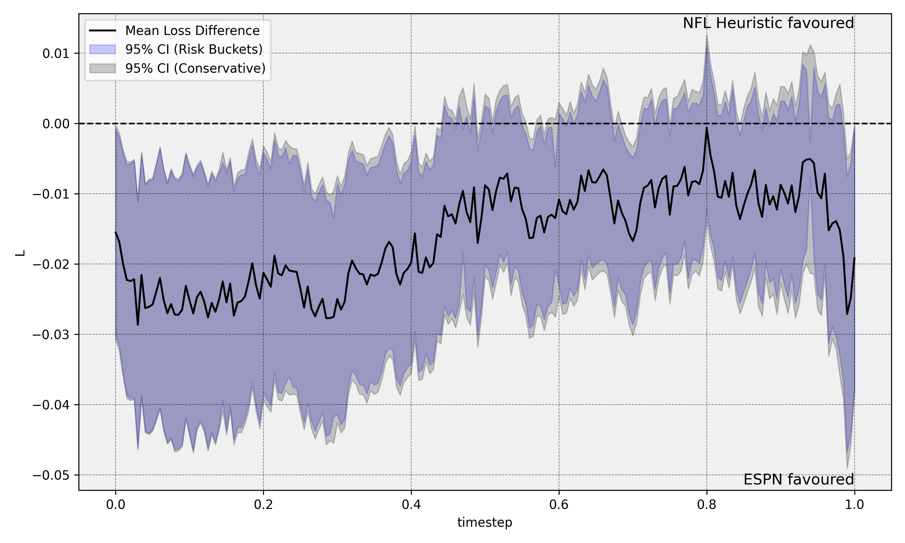
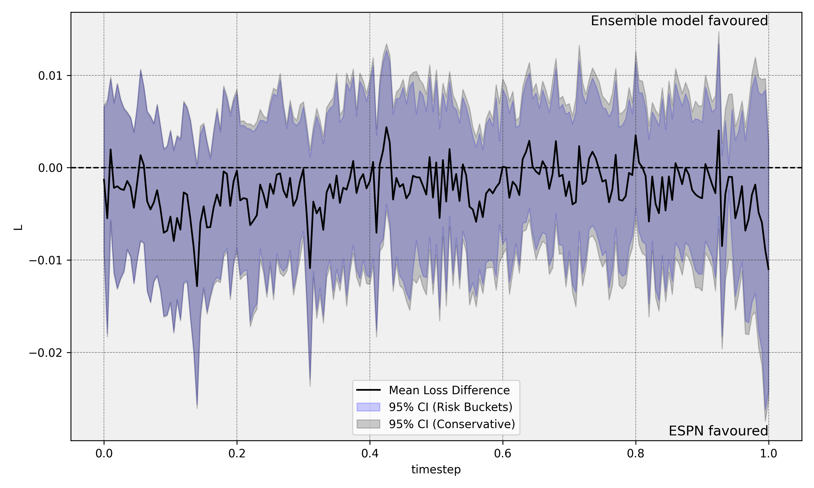

# Testing Model Equivalence and Superiority for Continuously Updated Probabilistic Forecasts

**Aly Shariff, Rohit Gajendragadkar, Jeffrey Negrea, Gregory Rice**

---

## Overview

This repository implements a statistical framework for **testing whether two continuously updated probabilistic forecasts are equivalent, or whether one is superior to the other**. Given two competing forecast sequences $\hat{p}^A_i(t)$ and $\hat{p}^B_i(t)$ over $n$ events, each evaluated at continuous intra-event time $t \in [0, 1]$, together with binary outcomes $Y_i$, the framework provides two families of test:

- **Unconditional (Diebold-Mariano style)**: is one forecaster better *on average* at some point in the event?
- **Conditional predictive ability (CPA)**: is one forecaster better *in particular states*, identified by instruments built from observed covariates? This can detect differences that cancel out on average and are therefore invisible to the unconditional test.

Both reduce to a supremum statistic over $t$ whose null distribution has no closed form and is obtained by Monte Carlo simulation of a Gaussian process limit.

The framework is validated on NFL in-game win probability forecasting, where trained ML models are benchmarked against ESPN's real-time forecasts.

---

## Repository Structure

```
.
├── evalCUPF/                       # Core framework, dataset-agnostic
│   ├── entries.py                  # Entries: the data container every test consumes
│   ├── covariance.py               # All covariance estimators (sigma_*)
│   ├── tests.py                    # The tests and confidence sets
│   ├── helpers.py                  # Losses, matrix sqrt/PSD repair, BM testbed
│   ├── data_loading.py             # Long-format CSV -> Entries
│   ├── build_instruments.py        # Runs instrument callbacks -> instruments CSV
│   ├── instruments_helper.py       # Instrument matrix interleaving mechanics
│   ├── risk_buckets.py             # Risk-bucket clustering for covariance estimation
│   ├── plotting.py                 # Sup-statistic and confidence-band plots
│   └── NFL_example/                # This dataset's specifics
│       ├── main.py                 # CLI: `cpa` and `bucket` subcommands + NFL constants
│       ├── instruments.py          # Instrument callbacks; writes the instruments CSV
│       ├── nfl_heuristic_bucketer.py
│       ├── nfl_bucketer.py
│       ├── combine_data.py
│       └── data/                   # Merged per-model forecast panels (gitignored)
│
├── NFL/                            # Forecasting models and data pipeline
│   ├── ML/
│   │   ├── notebooks/              # One notebook per model
│   │   ├── models/                 # Model classes (Optuna HPO, calibration)
│   │   └── data_preprocessing/     # Feature engineering, interpolation, scraping
│   └── test_final/                 # Results and plots
│
├── requirements.txt
└── README.md
```

---

## The Statistical Framework (`evalCUPF`)

### Problem Setup

Let $i$ index events and $t \in [0,1]$ denote normalized progress. The pointwise average loss difference is

$$\hat{\Delta}_n(t) = \frac{1}{n} \sum_{i=1}^n \left[ L(Y_i, \hat{p}^A_i(t)) - L(Y_i, \hat{p}^B_i(t)) \right]$$

with $L$ the Brier score by default. Negative values favour model $A$, positive values model $B$.

### Unconditional test

$$\mathcal{H}_0: \Delta(t) = 0 \quad \text{for all } t, \qquad T_n = \sup_{t \in [0,1]} \left| \sqrt{n}\, \hat{\Delta}_n(t) \right|$$

Under $\mathcal{H}_0$, $\sqrt{n}\,\hat{\Delta}_n(\cdot)$ converges weakly to a mean-zero Gaussian process $\Gamma$. For the Brier score the loss difference is linear in $Y_i$, giving the closed-form covariance kernel

$$C(t, s) = \lim_{n\to\infty} \frac{4}{n} \sum_{i=1}^n \delta_i(t)\,\delta_i(s)\; p_i(t \vee s)\left(1 - p_i(t \vee s)\right), \qquad \delta_i(t) = \hat{p}^A_i(t) - \hat{p}^B_i(t)$$

The $p_i(t \vee s)$ structure is the martingale property of the true probability path, the analogue of $\mathrm{Cov}(B_s, B_t) = \min(s,t)$ for Brownian motion.

### Conditional predictive ability (CPA)

The unconditional test can miss a real difference: if model $A$ is better in some states and model $B$ in others, the two can cancel in the average. CPA tests the sharper null

$$\mathcal{H}_0: \mathbb{E}\left[d_i(t) \mid \mathcal{F}_t\right] = 0 \quad \text{for all } t$$

where $d_i(t)$ is the per-event loss difference. This is operationalized through $m$ **instruments** $h_k(t)$, functions of covariates observable at time $t$, under which the null implies

$$\Delta_k(t) = \mathbb{E}\left[h_k(t)\, d(t)\right] = 0 \quad \text{for } k = 1, \dots, m$$

The statistic is the supremum of the Euclidean norm across instruments,

$$T_n^{\mathrm{CPA}} = \sup_{t \in [0,1]} \left\| \sqrt{n}\, \hat{\Delta}_n(t) \right\|_2, \qquad \hat{\Delta}_n(t) \in \mathbb{R}^m, \quad \hat{\Delta}_{n,k}(t) = \frac{1}{n}\sum_i h_{k,i}(t)\, d_i(t)$$

so the limit is an $\mathbb{R}^m$-valued Gaussian process with an $(mT \times mT)$ covariance. Taking $h \equiv 1$ recovers the unconditional test exactly.

Instruments are **interleaved** in the matrix layout: instrument $k$ at timestep $j$ occupies column $m \cdot j + k$.

### Covariance estimators

All live in [`covariance.py`](evalCUPF/covariance.py) and take an `Entries`:

| Estimator | Assumptions | Use |
|---|---|---|
| `sigma_avg` | None; generic sample covariance of the loss-difference paths | Default for the unconditional test |
| `sigma_quarter` | Uses $p(1-p) \le \tfrac14$ and drops negative cross terms | Conservative, assumption-free bands |
| `sigma_risk_bucket` | Local $p(t)$ estimated by clustering game states into risk buckets | Tighter bands when covariates are informative |
| `sigma_true` / `sigma_true_v2` | Requires a known or proxy true probability path | Exact; mainly for simulation studies |
| `sigma_cpa` | None; sample covariance of the *instrumented* loss differences | The CPA test |

`sigma_quarter` clips at $\max(0, \delta_i\delta_j)$ before scaling by $\tfrac14$, which preserves validity of the bound and guarantees a PSD result.

### Tests and confidence sets

In [`tests.py`](evalCUPF/tests.py):

| Function | Null hypothesis |
|---|---|
| `test_h0_avg` | $\Delta(t) = 0$ for all $t$ (unconditional) |
| `test_h0_cpa` | $\mathbb{E}[d(t) \mid \mathcal{F}_t] = 0$ (conditional, via instruments) |
| `weighted_integral_test` | $\int w(t)\Delta(t)\,dt = 0$ |
| `absolute_supremum_test` | $\sup_t |\Delta(t)| \le \varepsilon$ |
| `uniform_confidence_set` | joint band covering $\Delta(t)$ at all $t$ |
| `weighted_integral_confidence_set` | Wald CI for $\int w(t)\Delta(t)\,dt$ |

`p_value_from_covariance` is the shared primitive: given $\hat{\Delta}_n$ and any covariance estimate, it simulates $\sup_t|\Gamma(t)|$ and returns the empirical $p$-value.

---

## NFL Application

### Forecasting task

In-game win probability for the home team, 2016–2024. Games are discretized to $\Delta t = 0.005$ (201 timesteps over $[0,1]$); a separate model is trained per timestep on 2016–2022, validated on 2023, tested on 2024. Overtime excluded. Play-by-play events are mapped to the uniform grid by last-observation-carried-forward.

### Models

All use Optuna hyperparameter optimization and isotonic calibration, one instance per timestep: Logistic Regression, Random Forest, XGBoost, SVM, Feedforward NN, LSTM, Transformer Encoder, NFL Heuristic, and an Ensemble.

### Covariates available as instruments

`score_difference`, `predicted_drive_points_ev`, `relative_strength`, `end.down`, `end.distance`, `end.yardsToEndzone`, `home_timeouts_left`, `away_timeouts_left`, `home_has_possession`.

### Results: unconditional bands

Each plot shows $\hat{\Delta}_n(t)$ (black) with 95% pointwise bands: **blue** risk-bucket covariance, **grey** conservative. Bands excluding zero indicate a significant difference.

| | |
|---|---|
| **XGBoost vs ESPN**<br> | **Logistic Regression vs ESPN**<br> |
| **Random Forest vs ESPN**<br> | **SVM vs ESPN**<br> |
| **Neural Network vs ESPN**<br> | **LSTM vs ESPN**<br> |
| **Transformer vs ESPN**<br> | **NFL Heuristic vs ESPN**<br> |
| **Ensemble vs ESPN**<br> | |

### Results: unconditional vs conditional

Sweeping 9 covariates × 8 transforms as single instruments, over 544 games (10,000 simulations, $\alpha = 0.05$):

| Model (vs ESPN) | DM $p$ | best CPA $p$ | best instrument |
|---|---|---|---|
| logistic | **0.3850** | **0.0147** | `end.down` × $1/(1+\lvert x\rvert)$ |
| ensemble | 0.0340 | 0.0000 | `end.down` × $1/(1+\lvert x\rvert)$ |
| xgboost | 0.0023 | 0.0003 | `score_difference` × $\mathbb{1}[x<7]$ |
| lstm | 0.0003 | 0.0000 | `score_difference` × $x^2$ |
| svm | 0.0003 | 0.0000 | `score_difference` × $x^2$ |
| nn | 0.0000 | 0.0000 | `score_difference` × $1/(1+\lvert x\rvert)$ |
| transformer | 0.0000 | 0.0000 | `score_difference` × $1/(1+\lvert x\rvert)$ |
| rf | 0.0000 | 0.0000 | `score_difference` × $x^2$ |

The DM $p$-value is instrument-free: one number per model pair.

**The logistic row is the case of interest.** It is the only model ESPN is *not* distinguishable from unconditionally ($p = 0.385$), yet conditioning on down via $h(t) = 1/(1+|\text{end.down}|)$ rejects at $p \approx 0.015$. The instrument upweights early downs (1st down $\to 0.5$, 4th down $\to 0.2$), and the rejection comes from a single sharp excursion in the final few percent of game time. Every other model already rejects unconditionally, so CPA has no additional gap to demonstrate there.

Verified robust across 5 seeds at 10,000 simulations: DM $p \in [0.382, 0.391]$, CPA $p \in [0.015, 0.018]$. Adding a second instrument only weakened the result, so the single instrument is the cleanest example.

---

## Getting Started

### 1. Environment

```bash
git clone <repo-url>
cd <repo-root>

python -m venv env
source env/bin/activate       # Windows: env\Scripts\activate
pip install -r requirements.txt

export PYTHONPATH=$(pwd)      # Windows: set PYTHONPATH=%cd%
```

### 2. Run the CPA / DM tests

Instruments are precomputed into a CSV, so the test itself never evaluates a transform. Edit the `INSTRUMENTS` dict in [`NFL_example/instruments.py`](evalCUPF/NFL_example/instruments.py), then:

```bash
# Step 1: write h(t) values for every instrument in INSTRUMENTS
python -m evalCUPF.NFL_example.instruments --model logistic \
    --out evalCUPF/NFL_example/instruments_logistic.csv

# Step 2: run the tests
python -m evalCUPF.NFL_example.main cpa --model logistic --test both \
    --instruments-file evalCUPF/NFL_example/instruments_logistic.csv \
    --instrument-columns end_down_inv1p
```

```
[DM sup test]  sup|Gamma_n| = 0.0858  crit = 0.1155  p = 0.3851
[CPA test]     sup||Gamma_n|| = 0.0501  crit = 0.0450  p = 0.0187
```

Plots are written to `evalCUPF/NFL_example/output/` by default (`--no-plot` to skip): `dm_<model>.png`, `cpa_<model>.png` (sup statistic vs critical value), and `delta_<model>.png` (signed loss difference with both covariance bands).

| Flag | Meaning |
|---|---|
| `--model` | candidate model vs ESPN: `logistic`, `ensemble`, `lstm`, `nn`, `xgboost`, `svm`, `transformer`, `rf` |
| `--test` | `dm`, `cpa`, or `both` (default) |
| `--instrument-columns` | columns from the instruments CSV; pass several for a joint test ($m$ = count) |
| `--num-simulations` | Monte Carlo draws (default 10000) |
| `--alpha` | significance level (default 0.05) |
| `--seed` | RNG seed |
| `--out-dir` / `--no-plot` | plot destination / suppress plots |

The instruments CSV must be built with the same `--model` used for the test, so the row ordering matches.

### 3. Defining instruments

Each instrument is a plain function taking the dict of $(n, T)$ covariate matrices and returning one $(n, T)$ array of $h(t)$ values, free to combine several covariates:

```python
# evalCUPF/NFL_example/instruments.py
import numpy as np

def end_down_inv1p(cov):
    return 1.0 / (1.0 + np.abs(cov["end.down"]))

def late_game_score_gap(cov):
    return cov["score_difference"] ** 2 * (cov["end.down"] >= 3)

INSTRUMENTS = {
    "end_down_inv1p": end_down_inv1p,
    "late_game_score_gap": late_game_score_gap,
}
```

### 4. Run the risk-bucket test

A separate pipeline using per-game year-split CSVs and a clustering-based covariance:

```bash
python -m evalCUPF.NFL_example.main bucket \
    --data-dir NFL/ML/dataset_interpolated_fixed \
    --forecast-file NFL/test_final/LR_model_ezS_strawmen_combined_data.csv \
    --train-years 2021 2022 2023 \
    --test-years 2024 2025 \
    --features score_difference relative_strength end.yardsToEndzone end.down end.distance \
    --num-bucketers 50 --num-buckets 5 \
    --phat-a-label ESPN --phat-b-label "Logistic Regression" \
    --save-plot NFL/test_final/plot_LR_model_ezS_strawmen.png \
    --save-p-val NFL/test_final/p_val_LR_model_ezS_strawmen.txt
```

### 5. Using the framework on your own data

Nothing in `evalCUPF/` assumes the NFL layout; all column names and merge keys are caller-supplied. Build an `Entries` and call the tests directly:

```python
import numpy as np
import pandas as pd
from evalCUPF.entries import Entries
from evalCUPF.tests import test_h0_avg, test_h0_cpa

df = pd.read_csv("your_forecasts.csv")   # long format: one row per (event, timestep)

entries = Entries(timestep_size=0.005)
entries.load_entries(df, timestep="t", p_A="phat_A", p_B="phat_B",
                     y="Y", id_field="event_id")

# Unconditional test
dm = test_h0_avg(entries, num_simulations=10_000, alpha=0.05)
print(dm.p_value_approx)

# CPA test: attach precomputed h(t) values, one (n_events, T) array per instrument
entries.set_instrument_values([h1, h2])
cpa = test_h0_cpa(entries, num_simulations=10_000, alpha=0.05)
print(cpa.p_value_approx)
```

Required columns:

| Column | Type | Description |
|---|---|---|
| event id | str/int | Unique event identifier |
| timestep | float | $t \in [0,1]$, same grid for every event |
| `phat_A` | float | Model A probability forecast |
| `phat_B` | float | Model B probability forecast |
| `Y` | int | Binary outcome (0 or 1) |

For the conditional test, `evalCUPF.build_instruments.build_instruments_csv` will run your callbacks over a merged panel and write the instruments CSV; `evalCUPF.data_loading.load_instrument_matrices` reads it back aligned to an `Entries`.

---

## Dependencies

| Category | Libraries |
|---|---|
| ML | `scikit-learn`, `lightgbm`, `xgboost`, `catboost`, `torch`, `tensorflow` |
| HPO | `optuna` |
| Data | `pandas`, `numpy`, `scipy` |
| Visualization | `matplotlib`, `seaborn` |
| Interpretability | `shap` |

---

## Citation

> Shariff, A., Gajendragadkar, R., Negrea, J., & Rice, G. (2025). *Testing model equivalence and model superiority for continuously updated probabilistic forecasts.* University of Waterloo.
